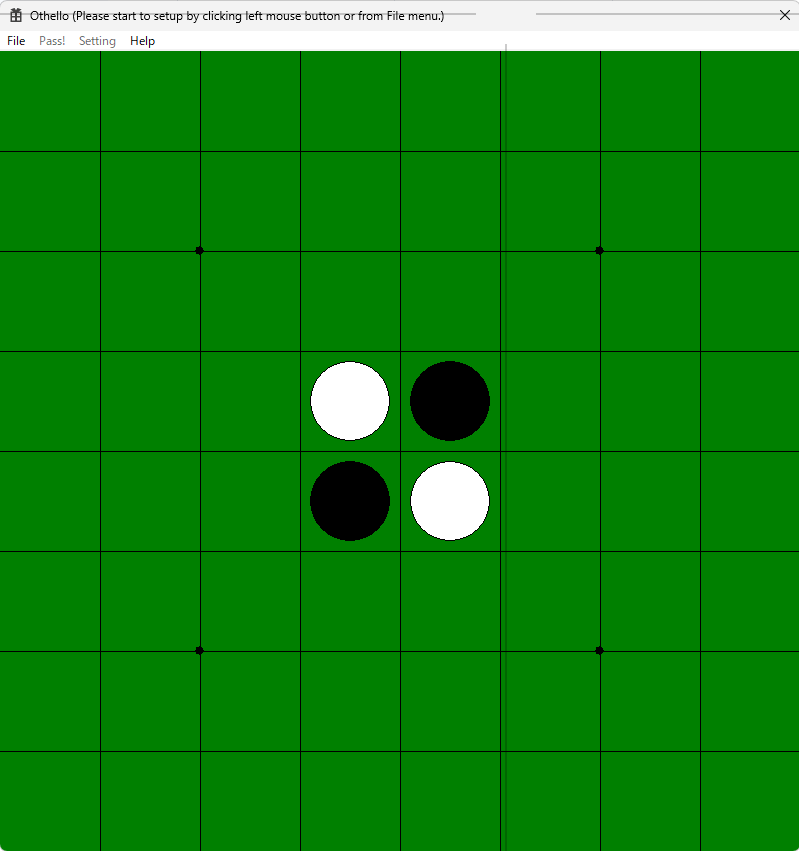

# オセロ(*1)

(*1) オセロ・Othelloは登録商標です。TM＆© Othello,Co. and MegaHouse

## はじめに
オセロゲームです。コンピュータとの対戦が可能です。 
内蔵している思考ルーチンは、CPUパワーに任せ評価関数に若干手を加えた点と探索の深さが深くなった点以外は作者が1988年頃に作成したものと同じです。 
なお、このオセロは作者がgithubおよびVisual Studioの習熟のため、および最新のAI技術を勉強するために作っています。よって今後はゲームとしての完成度を上げる方向ではなく、実験的な機能が増えていく方向でアップデートしていく予定です。  

## 制限事項
週末の趣味程度で開発しているものなので、完成度は期待しないで下さい。

## 推奨環境
Intel Core i5 2.4GHz程度のCPUであれば十分遊べます。

## 開発環境
Microsoft Visual Studio Community 2026での動作を確認しております。それ以外の環境については未確認ですが、基本的なAPIしか使用してないため、他のバージョンでも動作する可能性は高いと思います。

## コンパイル・実行
- 本ソースはレポジトリ"03_thinkerV3"内のソースを参照しますので、事前にレポジトリ"03_thinkerV3"内のソースを01_othelloと同じフォルダ内にダウンロードしておいて下さい。 
- othello.slnとexternalThinker_v1.slnの2つのプロジェクトファイルが存在します。othello.slnはオセロゲーム本体のプロジェクトファイル、externalThinker_v1.slnは外部思考ルーチンのプロジェクトファイルになります。それぞれVisual Studioでオープンしコンパイルすると、実行バイナリがx64\Releaseフォルダの下に作成されますので、それらをダブルクリックすることで実行できます。

### コマンドオプション
othello.exe [オプション]

|オプション|意味|
|-|-|
|-Bu|黒のプレーヤーを人間にセットします｡|
|-Bm[NumTemp]|黒のプレーヤーを内蔵思考ルーチンにセットします｡(NumTemp値の10の位以下)で指定したtemperatureに基づいて､ランダムな手を(NumTemp値/100)+1回打ちます｡NumTemp値を指定しなかった場合はランダムな手を打ちません｡|
|-Bx[IPaddressPort]|黒のプーレーヤーを[IPアドレス]:[ポート番号]形式で指定した[IPaddressPort]で待ち受ける外部試行ルーチンにセットします｡|
|-Wu|白のプレーヤーを人間にセットします｡|
|-Wm[NumTemp]|白のプレーヤーを内蔵思考ルーチンにセットします｡(NumTemp値の10の位以下)で指定したtemperatureに基づいて､ランダムな手を(NumTemp値/100)+1回打ちます｡NumTemp値を指定しなかった場合はランダムな手を打ちません｡|
|-Wx[IPaddressPort]|白のプーレーヤーを[IPアドレス]:[ポート番号]形式で指定した[IPaddressPort]で待ち受ける外部試行ルーチンにセットします｡|
|-R[num]|試合を自動的に開始し､num回数自動的に繰り返します｡繰り返す際に黒と白のプレーヤーを自動的に入れ替えます｡|
|-Cb[value]|試合終了後､初局黒の勝率をexit codeで報告します｡勝率がvalue値/10パーセント以上となった場合､progress barの色を変えます｡|
|-Cb[value]|試合終了後､初局白の勝率をexit codeで報告します｡勝率がvalue値/10パーセント以上となった場合､progress barの色を変えます｡|
|-p[place]|盤面を表示する位置を[place]にします｡[place]値として1～3が指定可能です｡|
|-a[p]|オプション"-R[num]"指定時､繰返し回数が全体の半数以上の場合に勝率が指定したp[パーセント]以上でなければ繰返しを中止します｡|

## 開発履歴
### 2025/11/16
開発環境をVisual Studio 2026に変更。
### 2025/3/9
Deep Learning版外部思考ルーチン"03_thinkerV3"の更新に併せ、以下の点を含む様々な点が更新されています。
* 開発環境をVisual Studio 2022に変更。
* 外部思考ルーチンを使用している場合、ゲーム終了時に外部思考ルーチンに対して"GameFinished"メッセージを送信するようにした。
* 対戦結果をgameResults.csvファイルに残すようにした。
* 同一カードを繰り返し実行するかどうかを設定するためのチェックボックスをゲーム設定ダイアログボックスに追加した。
  * 試合終了後に5秒間設定ダイアログが表示されますので、その間に連続実行のチェックを外すと連続実行が止まります。
  * 現実装では、強制的に各試合ごとにプレーヤーが白黒入れ替わります。
### 2020/9/27
異なるバージョン間の思考ルーチン同士で対戦ができるようにするため、思考ルーチン部分だけを別モジュールとした外部思考ルーチンに対応しました。

今回サンプルとして格納した外部思考ルーチンのプロジェクトファイルをexternalThinker_v1.slnとして格納しています。このプロジェクトを開いてコンパイルし実行させて下さい。実行させると、外部思考ルーチンはデフォルトでUDPのポート番号60001でメッセージ受信を待機します。

オセロ本体と同じマシンで外部思考ルーチンを動作させた場合は、オセロ本体の設定で"Computer(External)"のホスト名に"localhost"、ポート番号に"60001"とセットすると、この外部思考ルーチンを使って思考させることができます。もちろん外部思考ルーチンをネットワークにつながった別のマシン上で動作させても良いです。その場合はホスト名にそのマシンのホスト名を入れれば良いはずです。
### 2019/12/15
最初のバージョン。コンピュータとの対戦機能付き。コンピュータの思考ルーチンは古典的なミニマックス法を用いたもの。筆者が1988年頃に作ったものをリメイクした程度のもの。パラメータのチューニングはまだほとんど行っていません。外部思考ルーチンにはまだ未対応です。
